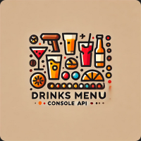

    
    <h1>Drinks Info</h1>

Welcome to the **Drinks Info** App!

This is a .NET project designed to demonstrate using HTTP requests on an external API to retrieve and display data.

Users can explore various drink categories, select specific drinks (or try their luck with a random one), and view detailed information about them.

The application is built as a console application using the [Spectre Console](https://spectreconsole.net/) library for enhanced user interaction.

## Features

- **Spectre Console**:
  - The console front end has been built and styled with Spectre Console.
- **Drinks**
  - Users can select drinks by category or select a random drink.
  - Selecting a drink with show detailed information. Empty data is not shown.
- **External API**
  - Drinks data is retrieved from TheCocktailDB api.
  - RestSharp is used to perform external api functions.

## Technologies

- .NET
- REST

## Getting Started

### Prerequisites

- .NET 8 SDK.
- An IDE (code editor) like Visual Studio or Visual Studio Code.

### Installation

1. Clone the repository:

    - `git clone https://github.com/chrisjamiecarter/drinks-info.git`
    
2. Navigate to the Console project directory:

   - `cd src\DrinksInfo.ConsoleApp`

3. Configure the application:

   - Update any required settings in `appsettings.json` to target your environment:
     - DrinkApiClientOptions
       - Root: The root api address to target.
       - Version: The version of the api to target.
       - Key: The api key.

4. Build the application using the .NET CLI:

   - `dotnet build`
 
### Running the Application

1. You can start the `DrinksInfo.ConsoleApp` project from Visual Studio.

OR

1. Run the `DrinksInfo.ConsoleApp` project using the .NET CLI:

   - `cd src\DrinksInfo.ConsoleApp`
   - `dotnet run`

### Usage

- **Main Menu**
    - A main menu is presented and contains a list of options to perform.
- **Select Drink By Category**
    - Gets the categories from the api and displays them.
    - Prompts the user to select a category.
    - When a category is selected, it gets the drink from the api and displays it.
- **Random Drink**
    - Gets a random drink from the api and displays it.

## How It Works

- **Console Project**
    - The [Spectre Console](https://spectreconsole.net/) library is used to aid user interactions through the console terminal.
- **Menu Navigation**
    - Navigate the application through the Selection Prompts class provided by Spectre to perform actions.
**RestSharp**
    - The [RestSharp](https://restsharp.dev/) simple REST and HTTP API client for .NET is used to perm HTTP requests to the external API.
- **Data Access**
    - The [TheCocktailDB](https://www.thecocktaildb.com/api.php) free public API is used for accessing the required data.

## Project Architecture

The solution is structured in a way that enforces separation of concerns, making the codebase more maintainable, scalable, and testable.

- **Application Layer**
    - Contains the core business logic, models, and defines the required abstractions.
- **Contracts Layer**
    - Defines reusable contracts for the external api.
- **Presentation Layer**
    - Provides the user interface, built with Spectre Console, and interacts with the application layer.

## Version

This document applies to the DrinksInfo v2.0.0 release version.

## Contributing

Contributions are welcome! Please fork the repository and create a pull request with your changes. For major changes, please open an issue first to discuss what you would like to change.

## License

This project is licensed under the MIT License. See the [LICENSE](./LICENSE) file for details.

## Contact

For any questions or feedback, please open an issue.

---
***Happy Drinks Infoing!***
